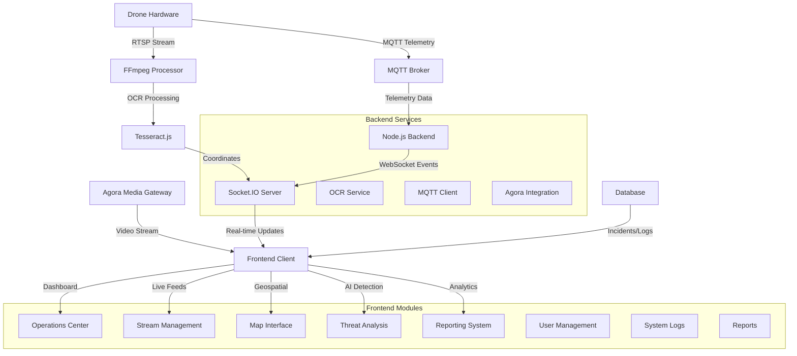
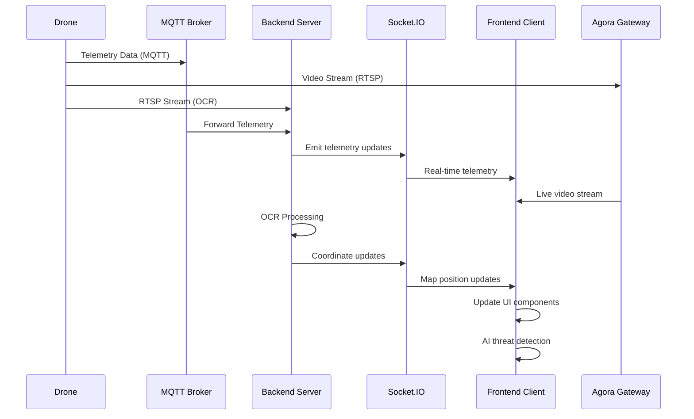

# ISR Command & Control System

## System Overview

The ISR (Intelligence, Surveillance, and Reconnaissance) Command & Control System is a comprehensive web-based platform for real-time drone surveillance, telemetry monitoring, and threat detection. The system integrates multiple data sources including MQTT telemetry, real-time video streaming via Agora, OCR-based coordinate extraction, and AI-powered threat detection.

## System Architecture



## Data Flow Diagram



## Core Components

### Backend Services

#### 1. **Node.js Express Server** (`server.js`)

- **Purpose**: Main application server handling HTTP requests and WebSocket connections
- **Key Features**:
  - Static file serving for frontend assets
  - Socket.IO WebSocket server for real-time communication
  - MQTT client integration for drone telemetry
  - FFmpeg-based RTSP stream processing
  - Tesseract.js OCR for coordinate extraction

#### 2. **MQTT Integration**

```javascript
// Configuration
const droneSN = "1581F5FJD238900D79WS";
const mqttBrokerUrl = "mqtt://192.168.1.54:1883";
const mqttTopic = "thing/product/1581F5FJD238900D79WS/osd";
```

- **Purpose**: Receives real-time telemetry data from drone systems
- **Data Flow**: MQTT → Backend → Socket.IO → Frontend
- **Telemetry Includes**: GPS coordinates, battery status, altitude, gimbal orientation

#### 3. **OCR Coordinate Extraction**

- **Input**: RTSP video stream from drone camera
- **Processing**: FFmpeg crops video region, enhances contrast, extracts text
- **Output**: Real-time GPS coordinates parsed from on-screen display
- **Recognition**: Tesseract.js with whitelist for coordinates (0-9, ., N, S, E, W)

#### 4. **Agora Media Gateway**

```javascript
// Agora Configuration
const AGORA_CONFIG = {
  appId: "631ce9ab63034612ab47acaf2167a80a",
  channel: "body-cam-new",
  uid: 100,
};
```

- **Purpose**: Ultra-low latency video streaming
- **Protocol**: Native RTC instead of RTMP
- **Features**: Multi-channel support, stream management, token-based authentication

### Frontend Architecture

#### 1. **Dashboard** (`dashboard.html`)

- **Purpose**: Main operations center with system overview
- **Components**:
  - Key performance metrics (incidents, threats, assets, response time)
  - Live stream grid with connection status
  - Recent incidents feed
  - System health indicators

#### 2. **Live Feeds** (`index.html`)

- **Purpose**: Multi-stream video monitoring interface
- **Features**:
  - Grid layout for multiple drone feeds
  - Real-time stream status indicators
  - Feed filtering and search capabilities
  - Modal view for detailed stream analysis
  - Agora WebRTC integration for ultra-low latency

#### 3. **Geospatial Map** (`geospatial.html`)

- **Purpose**: Interactive map interface for drone tracking
- **Technology**: MapLibre GL JS
- **Features**:
  - Real-time drone position updates
  - Multiple basemap options (Dark Matter, Positron, Satellite)
  - Incident markers and overlays
  - Coordinate display and tracking

#### 4. **AI Detection** (`aiDetection.html`)

- **Purpose**: AI-powered threat and anomaly detection interface
- **Capabilities**:
  - Real-time analysis of video feeds
  - Detection categories: Oil spillages, illegal refineries, pipeline damage
  - Confidence scoring and accuracy metrics
  - Detection filtering and export functionality

#### 5. **Incident Management** (`incident.html`)

- **Purpose**: Comprehensive incident tracking and management
- **Features**:
  - Incident categorization and status tracking
  - Search and filtering capabilities
  - Priority-based incident handling
  - Timeline and escalation management

#### 6. **Analytics Dashboard** (`analytics.html`)

- **Purpose**: Performance metrics and trend analysis
- **Visualizations**:
  - Chart.js integration for data visualization
  - Incident trends and threat distribution
  - Regional activity analysis
  - System performance monitoring

#### 7. **Threat Detection** (`threat.html`)

- **Purpose**: Specialized threat analysis and verification
- **Detection Types**:
  - Human/vehicle/boat detection
  - Weapon identification
  - Suspicious behavior analysis
  - Unauthorized entry alerts
  - Pipeline integrity monitoring

#### 8. **User Management** (`users.html`)

- **Purpose**: System user administration
- **Features**:
  - Role-based access control
  - User activity tracking
  - Permission management
  - Authentication status monitoring

#### 9. **System Logs** (`logs.html`)

- **Purpose**: System monitoring and debugging interface
- **Log Categories**:
  - System events (INFO, WARNING, ERROR, CRITICAL)
  - Security audit logs
  - Operational logs
  - Performance metrics

#### 10. **Reports** (`reports.html`)

- **Purpose**: Automated report generation and scheduling
- **Output Formats**: PDF, Excel, Word, PowerPoint
- **Report Types**:
  - Daily operations summary
  - Weekly threat analysis
  - Monthly operational reports
  - Custom incident analysis

### JavaScript Modules

#### 1. **Main Script** (`script.js`)

- **Agora WebRTC Integration**: Multi-client management for different drone feeds
- **Stream Management**: Connection handling, status updates, video display
- **UI Components**: Theme management, sidebar navigation, modal dialogs
- **Real-time Updates**: Socket.IO event handling for telemetry data

#### 2. **Dashboard Script** (`dashboard.js`)

- **Metrics Animation**: Counter animations for key performance indicators
- **Stream Grid**: Dashboard-specific stream card generation
- **Incident Feed**: Recent incidents display and interaction
- **Performance Monitoring**: System health and operational metrics

#### 3. **Telemetry Stream** (`telemetryStream.js`)

- **Map Integration**: MapLibre GL JS initialization and control
- **Real-time Tracking**: Drone position updates via Socket.IO
- **Basemap Management**: Dynamic map style switching
- **Coordinate Processing**: GPS data parsing and display

### Styling and UI Framework

#### **Custom CSS** (`style.css`)

- **Dark Theme**: Comprehensive dark mode implementation
- **Animations**: Fade-in, slide-in, and scale transitions
- **Component Styling**: Stream cards, modal dialogs, status indicators
- **Responsive Design**: Mobile-first approach with Tailwind CSS integration
- **Accessibility**: Focus states and keyboard navigation support

## Installation and Setup

### Prerequisites

- Node.js 18+
- MQTT Broker (Mosquitto recommended)
- FFmpeg (automatically installed via @ffmpeg-installer/ffmpeg)
- Agora.io account and credentials

### Installation Steps

1. **Clone and Install**

```bash
git clone <repository>
cd isr-command-control
npm install
```

2. **Configuration**

```bash
# Update MQTT broker settings in server.js
const mqttBrokerUrl = 'mqtt://YOUR_MQTT_BROKER:1883';
const mqttTopic = 'thing/product/YOUR_DRONE_SN/osd';

# Update Agora credentials in script.js
const AGORA_CONFIG = {
    appId: "YOUR_AGORA_APP_ID",
    token: "YOUR_AGORA_TOKEN",
    channel: "YOUR_CHANNEL_NAME"
};
```

3. **Start the Application**

```bash
npm start
```

4. **Access the System**

- Open browser to `http://localhost:4000`
- Default landing page: Dashboard (`dashboard.html`)

## API Documentation

### WebSocket Events (Socket.IO)

#### **Client → Server Events**

- `connection`: Client connects to WebSocket server
- `disconnect`: Client disconnects from WebSocket server

#### **Server → Client Events**

- `droneDataUpdate(data, sn)`: Real-time telemetry data
  ```json
  {
    "data": {
      "latitude": 4.8242,
      "longitude": 7.0336,
      "height": 120.5,
      "battery": {
        "capacity_percent": 85
      },
      "67-0-0": {
        "gimbal_yaw": 180.0
      }
    }
  }
  ```

### MQTT Topics

#### **Drone Telemetry**

- **Topic**: `thing/product/{DRONE_SN}/osd`
- **QoS**: 0 (At most once delivery)
- **Format**: JSON payload with telemetry data

### Agora Integration

#### **Channel Management**

```javascript
// Join channel for specific drone feed
async function joinAgoraChannel(device) {
  const client = AgoraRTC.createClient({ mode: "live", codec: "h264" });
  await client.join(device.appId, device.agoraChannel, device.token, device.sn);
  return client;
}
```

#### **Stream Configuration**

- **Mode**: Live broadcasting
- **Codec**: H.264 for optimal compatibility
- **Role**: Audience (receiver) for drone feeds
- **UID**: Drone serial number for identification

## Security Considerations

### Authentication

- Session-based authentication with secure session secrets
- Role-based access control for different user levels
- Token-based Agora stream authentication

### Network Security

- MQTT over TLS recommended for production
- WebSocket secure connections (WSS) for encrypted real-time data
- CORS configuration for cross-origin request handling

### Data Privacy

- Encrypted storage for sensitive telemetry data
- Audit logging for all user actions
- Secure credential management for external services

## Performance Optimization

### Frontend

- Lazy loading for large datasets
- Virtual scrolling for long lists
- Debounced search inputs to reduce server load
- Efficient DOM manipulation with minimal redraws

### Backend

- Connection pooling for database operations
- MQTT message queuing for high-throughput scenarios
- FFmpeg stream optimization for OCR processing
- Socket.IO room management for targeted updates

### Monitoring

- Real-time system health indicators
- Performance metrics dashboard
- Error tracking and alerting
- Resource usage monitoring

## Development Guidelines

### Code Structure

- Modular architecture with clear separation of concerns
- Consistent naming conventions across all components
- Comprehensive error handling and logging
- Documentation for all major functions and APIs

### Testing

- Unit tests for critical backend functions
- Frontend component testing for UI interactions
- Integration tests for MQTT and WebSocket communications
- Performance testing for high-load scenarios

### Deployment

- Environment-specific configuration management
- Docker containerization for consistent deployment
- Health check endpoints for monitoring
- Graceful shutdown handling for maintenance

## Troubleshooting

### Common Issues

1. **MQTT Connection Failed**

   - Verify broker IP address and port
   - Check firewall settings
   - Validate topic permissions

2. **Agora Stream Not Loading**

   - Verify App ID and token validity
   - Check channel name configuration
   - Ensure network connectivity to Agora servers

3. **OCR Coordinate Extraction Issues**

   - Verify RTSP stream accessibility
   - Check FFmpeg crop parameters for video resolution
   - Validate Tesseract.js whitelist configuration

4. **WebSocket Connection Drops**
   - Implement reconnection logic
   - Check server resource usage
   - Validate client-side error handling

### Debug Mode

```bash
# Enable detailed logging
DEBUG=socket.io:* npm start
```

### Log Analysis

- Check browser console for client-side errors
- Monitor server logs for backend issues
- Use network tab to diagnose connectivity problems

## Future Enhancements

### Planned Features

- Machine learning integration for predictive analytics
- Mobile application for field operations
- Advanced threat correlation algorithms
- Integration with external command systems
- Automated incident response workflows

### Scalability Improvements

- Microservices architecture migration
- Redis for session management and caching
- Load balancing for multiple server instances
- Database clustering for high availability
- CDN integration for global deployment

## Support and Maintenance

### Documentation

- API documentation with OpenAPI/Swagger
- User manual for operational procedures
- Developer onboarding guide
- System administration manual

### Version Control

- Semantic versioning for releases
- Feature branching workflow
- Automated testing and deployment
- Change log maintenance

### Community

- Issue tracking and bug reports
- Feature requests and enhancements
- Developer forum and discussions
- Regular security updates and patches
