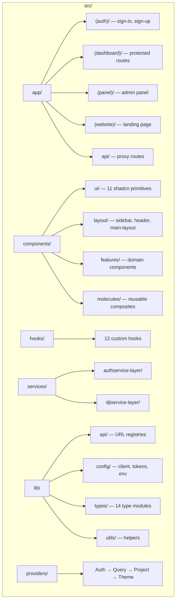
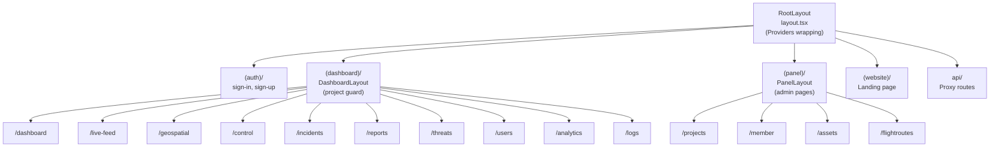
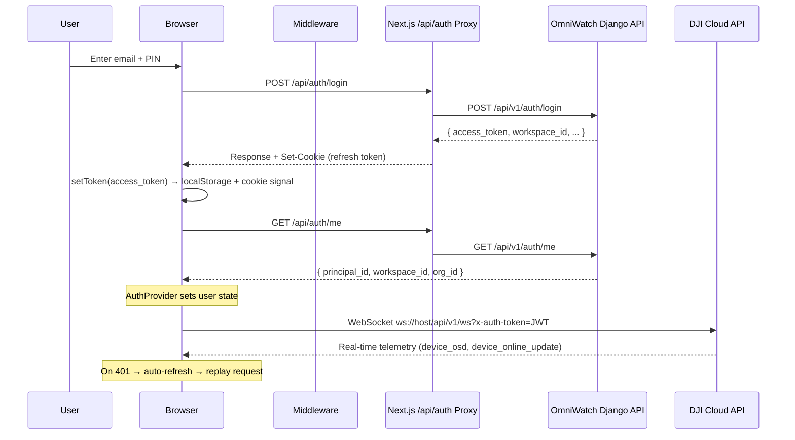
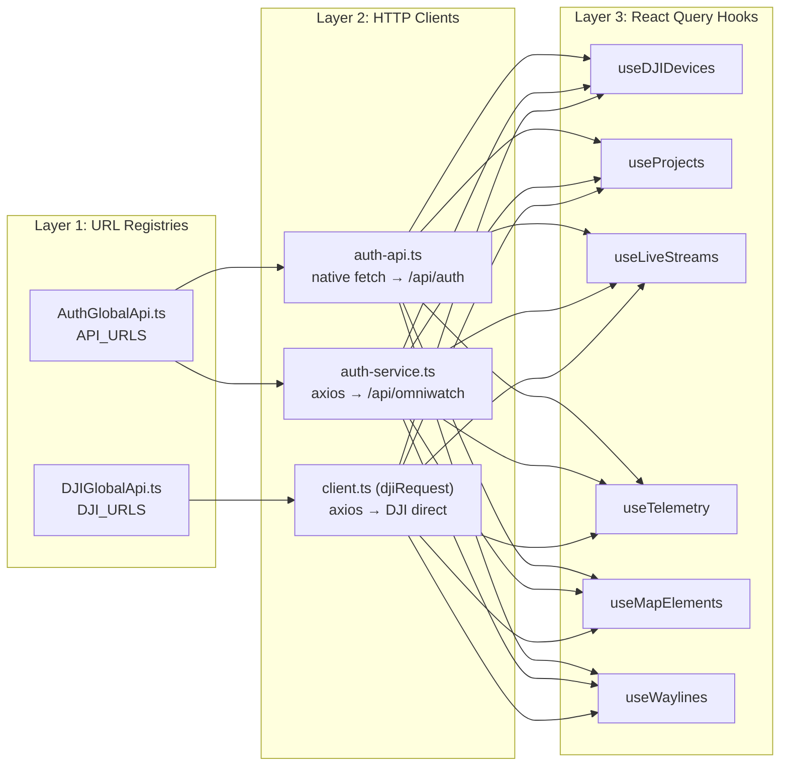
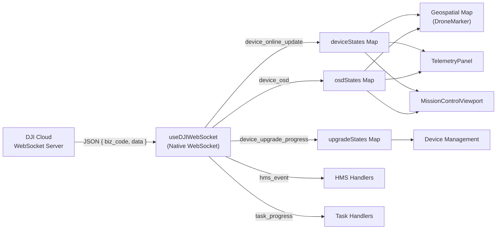
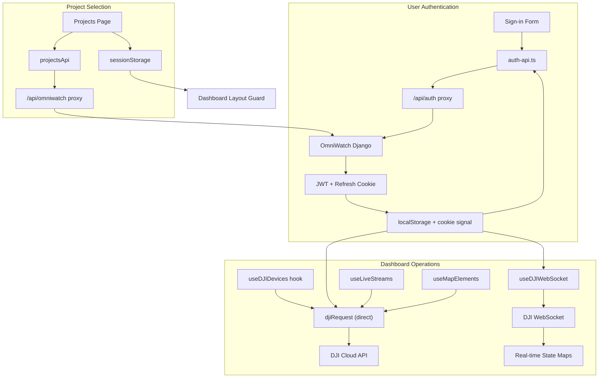

# OmniWatch ISR C&C — Full Architecture Walkthrough

> **Perspectives:** UI/UX Design · Professional Web Development · Security Analysis

---

## 1. Executive Summary

**OmniWatch** is an **ISR (Intelligence, Surveillance, and Reconnaissance) Command & Control** web frontend built with **Next.js 15 + TypeScript + Tailwind CSS**. It provides a centralized command center for managing DJI drone fleets, processing live video via WebRTC, visualizing geospatial telemetry on MapLibre maps, and managing organizational projects/teams through a custom Django backend ("OmniWatch API").

The architecture follows a **dual-backend pattern**:
- **OmniWatch API** (`http://34.35.12.123:8002`) — Django/Python auth, projects, teams, org management
- **DJI Cloud API** (`http://35.222.89.171:6789`) — Device management, live streams, waylines, flight control

Both are accessed through **Next.js API route proxies** to avoid CORS issues, with a **native WebSocket** connection to the DJI backend for real-time telemetry.

---

## 2. Technology Stack

| Layer | Technology | Version |
|---|---|---|
| Framework | Next.js (App Router) | ^15.0.0 |
| Language | TypeScript | ^5 |
| UI Library | React | ^18 |
| Styling | Tailwind CSS + CSS Variables | ^3.3.0 |
| State Management | React Context + TanStack React Query | ^5.90.2 |
| HTTP Client | Axios (DJI) / native `fetch` (OmniWatch) | ^1.12.2 |
| Real-time | Native WebSocket (DJI) / Socket.IO client (legacy) | — |
| Mapping | MapLibre GL JS + react-map-gl | ^5.8.0 / ^8.0.4 |
| Video Streaming | WebRTC (custom player) + Agora SDK (legacy) | — |
| Forms | React Hook Form + Zod | ^7.63.0 / ^4.1.11 |
| UI Components | Radix UI primitives + shadcn/ui patterns | Various |
| Theming | next-themes | ^0.4.6 |
| Package Manager | pnpm | — |

---

## 3. Project Structure



### Key Directories

| Directory | Purpose | Files |
|---|---|---|
| [app/(auth)/](file:///c:/Users/MR%20BROWN/Documents/Frontend/omni-watch-latest-frontend/src/app/(auth)) | Sign-in / Sign-up pages | 2 routes |
| [app/(dashboard)/](file:///c:/Users/MR%20BROWN/Documents/Frontend/omni-watch-latest-frontend/src/app/(dashboard)) | All protected dashboard pages | 10 route groups |
| [app/(panel)/](file:///c:/Users/MR%20BROWN/Documents/Frontend/omni-watch-latest-frontend/src/app/(panel)) | Admin panel (projects, members, assets, flight routes) | 4 route groups |
| [app/(website)/](file:///c:/Users/MR%20BROWN/Documents/Frontend/omni-watch-latest-frontend/src/app/(website)) | Landing/marketing page | 1 page (38KB) |
| [app/api/](file:///c:/Users/MR%20BROWN/Documents/Frontend/omni-watch-latest-frontend/src/app/api) | 3 reverse proxy routes | auth, dji, omniwatch |
| [components/features/](file:///c:/Users/MR%20BROWN/Documents/Frontend/omni-watch-latest-frontend/src/components/features) | Domain-specific components | 7 feature groups |
| [hooks/](file:///c:/Users/MR%20BROWN/Documents/Frontend/omni-watch-latest-frontend/src/hooks) | Custom React hooks | 12 hooks |
| [services/](file:///c:/Users/MR%20BROWN/Documents/Frontend/omni-watch-latest-frontend/src/services) | API service layers | 2 service modules |
| [lib/](file:///c:/Users/MR%20BROWN/Documents/Frontend/omni-watch-latest-frontend/src/lib) | Shared utilities, types, config | 4 sub-modules |
| [providers/](file:///c:/Users/MR%20BROWN/Documents/Frontend/omni-watch-latest-frontend/src/providers) | React Context providers | 5 providers |

---

## 4. Route Architecture

### Route Groups & Layout Nesting



### Protection Flow

1. **Edge Middleware** ([middleware.ts](file:///c:/Users/MR%20BROWN/Documents/Frontend/omni-watch-latest-frontend/src/middleware.ts)) — checks for `dji_auth_token` cookie presence
2. **Dashboard Layout Guard** ([layout.tsx](file:///c:/Users/MR%20BROWN/Documents/Frontend/omni-watch-latest-frontend/src/app/(dashboard)/layout.tsx)) — checks `activeProject` from `ProjectProvider`, redirects to `/projects` if none selected
3. **AuthProvider** ([AuthProvider.tsx](file:///c:/Users/MR%20BROWN/Documents/Frontend/omni-watch-latest-frontend/src/providers/AuthProvider.tsx)) — restores session from localStorage on mount, schedules proactive token refresh

---

## 5. Authentication & Authorization Flow



### Token Storage Architecture

| Storage | Content | Purpose |
|---|---|---|
| `localStorage["dji_auth_token"]` | Raw JWT string | Attached to DJI API requests via `x-auth-token` header |
| `localStorage["dji_token_expires"]` | Absolute timestamp (ms) | Used by `getToken()` to auto-clear expired tokens |
| Cookie `dji_auth_token=true` | Boolean signal | Read by Edge middleware to check auth state |
| HttpOnly cookie (from Django) | Refresh token | Sent back to `/api/auth/token/refresh` for silent refresh |

---

## 6. API Layer Design

### Three-Tier Service Architecture



### Proxy Routes

| Browser Path | Forwards To | Purpose |
|---|---|---|
| `/api/auth/*` | `http://34.35.12.123:8002/api/v1/auth/*` | OmniWatch auth (login, me, refresh) |
| `/api/omniwatch/*` | `http://34.35.12.123:8002/api/v1/*` | OmniWatch CRUD (projects, teams, org) |
| `/api/dji/*` | `http://35.222.89.171:6789/*` | DJI Cloud API (devices, streams, waylines) |

> [!IMPORTANT]
> The DJI API client ([client.ts](file:///c:/Users/MR%20BROWN/Documents/Frontend/omni-watch-latest-frontend/src/lib/config/client.ts)) makes **direct browser-to-DJI** requests (bypassing the proxy), while auth and OmniWatch calls go through the Next.js proxy. This creates an inconsistency — see Security section.

---

## 7. Real-Time Data Pipeline



### Key WebSocket Events

| `biz_code` | Payload | Consumer |
|---|---|---|
| `device_online_update` | `{ sn, online_status, battery_percent, lat, lon, ... }` | Device sidebar, map markers |
| `device_osd` | `{ sn, host: { longitude, latitude, height, speed, battery, ... } }` | Telemetry panel, map GPS tracking |
| `hms_event` | `{ sn, level, message_en }` | Health monitoring system |
| `task_progress` | `{ job_id, status, progress }` | Wayline job tracking |
| `device_upgrade_progress` | `{ sn, host: { progress, status } }` | OTA firmware updates |

---

## 8. Component Hierarchy

### Feature Component Groups

| Feature Group | Components | Purpose |
|---|---|---|
| **control/** | 10 components | Mission control viewport, flight actions, telemetry HUD, dock monitor |
| **streams/** | 10 components | WebRTC player, multi-feed view, stream control panel, device sidebar |
| **geospatial-map/** | 11 components | MapLibre map, drone markers, wayline panel, flight areas, element CRUD |
| **devices/** | 2 components | Register/edit device modals |
| **incidents/** | 1 component | Incident card (mockup) |
| **metrics/** | 2 components | Metric card, stat card |
| **filters/** | — | Filter components |

### Provider Nesting Order

```
ThemeProvider (dark/light mode via next-themes)
  └── AuthProvider (JWT lifecycle, user state)
       └── QueryProvider (TanStack React Query cache)
            └── ProjectProvider (active project from sessionStorage)
                 └── {children}
```

---

## 9. UI/UX Assessment

### ✅ Strengths

1. **Military-grade dark theme** — Deep blacks (`#0C0E12`, `#050709`), emerald accent palette, scanning line effects create an authentic ISR command center aesthetic
2. **HUD-style viewport** — Crosshair overlay, compass inset, real-time status badges on the mission control viewport are visually premium
3. **Responsive sidebar** — Collapses on mobile with overlay, active state indicator with sky-blue left border
4. **Design system** — CSS variables for theming, shadcn/ui component primitives provide consistency
5. **Custom scrollbar** — Surveillance-themed gradient scrollbar adds polish
6. **Micro-animations** — `fadeIn`, `scaleIn`, `slideIn` keyframes, parallax effects, `prefers-reduced-motion` support

### ⚠️ Areas for Improvement

1. **Font conflict** — [layout.tsx](file:///c:/Users/MR%20BROWN/Documents/Frontend/omni-watch-latest-frontend/src/app/layout.tsx) loads Poppins as `--font-poppins` CSS variable, but `<body>` hardcodes `fontFamily: 'Inter, sans-serif'`. Inter is never loaded from Google Fonts — the browser falls back to system sans-serif, creating inconsistent typography.
2. **Hardcoded coordinates** — [MissionControlViewport.tsx:305-309](file:///c:/Users/MR%20BROWN/Documents/Frontend/omni-watch-latest-frontend/src/components/features/control/MissionControlViewport.tsx#L305-L309) displays hardcoded Lagos coordinates (`Lat: 6.5244° N, Lon: 3.3792° E`) instead of live telemetry data. Same with `heading = 247` on line 77.
3. **Missing loading states** — The `(website)` landing page is a single 38KB file with no code splitting. Dashboard loading states exist but are basic spinners.
4. **Toaster disabled** — [Providers.tsx](file:///c:/Users/MR%20BROWN/Documents/Frontend/omni-watch-latest-frontend/src/providers/Providers.tsx#L26) has the Sonner `<Toaster>` commented out, meaning toast notifications are silently swallowed.
5. **Typo in directory** — `feature-unbording` (should be `feature-onboarding`), `geospaital-map` (should be `geospatial-map`)
6. **Focus outlines suppressed globally** — [globals.css:224-227](file:///c:/Users/MR%20BROWN/Documents/Frontend/omni-watch-latest-frontend/src/app/globals.css#L224-L227) removes all button/link focus outlines, violating WCAG 2.1 accessibility requirements
7. **No error boundary** — [error.tsx](file:///c:/Users/MR%20BROWN/Documents/Frontend/omni-watch-latest-frontend/src/app/error.tsx) exists at root but there are no per-route error boundaries for granular recovery

---

## 10. Security Audit

### 🔴 Critical Issues

#### S1 — JWT Stored in localStorage (XSS Target)
**File:** [token-store.ts](file:///c:/Users/MR%20BROWN/Documents/Frontend/omni-watch-latest-frontend/src/lib/config/token-store.ts)

The raw JWT is stored in `localStorage`, making it accessible to any XSS vulnerability. A single DOM injection or malicious third-party script can exfiltrate the token and impersonate the user.

> [!CAUTION]
> **Recommendation:** Migrate to HttpOnly cookies for token storage. The Next.js API proxy can set and forward cookies, and the auth proxy already handles `Set-Cookie` forwarding. The token should never be readable by client-side JavaScript.

#### S2 — Auth Token Leaked in WebSocket URL
**File:** [useDJIWebSocket.ts:169](file:///c:/Users/MR%20BROWN/Documents/Frontend/omni-watch-latest-frontend/src/hooks/useDJIWebSocket.ts#L169)

```typescript
const url = `${base}/api/v1/ws?x-auth-token=${token}`;
```

The JWT is passed as a URL query parameter. URL parameters are logged in server access logs, browser history, proxy logs, and any network monitoring tool. This is a credential exposure vector.

> [!CAUTION]
> **Recommendation:** If the DJI WebSocket server supports it, send the token via a WebSocket subprotocol header or as the first message after connection. If not possible, document this as an accepted risk and ensure the WebSocket URL is never logged.

#### S3 — `.env` File Committed to Repository
**File:** [.env](file:///c:/Users/MR%20BROWN/Documents/Frontend/omni-watch-latest-frontend/.env)

The `.env` file contains backend server IP addresses (`34.35.12.123`, `35.222.89.171`) and is present in the working tree. While `.gitignore` lists `.env`, the file exists on disk alongside git — if a previous commit included it, the credentials are in git history.

> [!WARNING]
> **Recommendation:** Verify git history: `git log --all --full-history -- .env`. If ever committed, rotate all exposed IPs/credentials. Use `.env.local` (which is also in `.gitignore`) for actual secrets.

#### S4 — Direct Browser-to-DJI API Calls (Bypasses Proxy)
**File:** [client.ts](file:///c:/Users/MR%20BROWN/Documents/Frontend/omni-watch-latest-frontend/src/lib/config/client.ts)

The `djiRequest` client sends requests directly from the browser to `http://35.222.89.171:6789` (bypassing the `/api/dji` proxy). This exposes the DJI server IP in browser network tabs and relies on CORS being open on the DJI server.

> [!WARNING]
> **Recommendation:** Route all DJI API calls through the Next.js `/api/dji` proxy. This keeps the backend IP hidden and enables server-side token management.

### 🟡 Medium Issues

#### S5 — No CSRF Protection on Proxy Routes
**Files:** All three proxy route handlers

The Next.js API route proxies forward any request without verifying the request origin. An attacker could craft a cross-site request to `/api/auth/login` or `/api/omniwatch/projects/` from a malicious page.

> **Recommendation:** Add CSRF token validation or at minimum check the `Origin`/`Referer` header against a whitelist in proxy routes.

#### S6 — Excessive Console Logging of Auth Data
**Files:** [auth-api.ts](file:///c:/Users/MR%20BROWN/Documents/Frontend/omni-watch-latest-frontend/src/services/authservice-layer/auth-api.ts), [auth-service.ts](file:///c:/Users/MR%20BROWN/Documents/Frontend/omni-watch-latest-frontend/src/services/authservice-layer/auth-service.ts), [AuthProvider.tsx](file:///c:/Users/MR%20BROWN/Documents/Frontend/omni-watch-latest-frontend/src/providers/AuthProvider.tsx)

Auth flow logs include workspace IDs, user IDs, token presence indicators, and full API response bodies to `console.log`. In production, any user can open DevTools and see these.

> **Recommendation:** Wrap all console statements in a `process.env.NODE_ENV !== 'production'` guard, or use a structured logger with configurable levels.

#### S7 — No Rate Limiting on Auth Proxy
**File:** [route.ts (auth)](file:///c:/Users/MR%20BROWN/Documents/Frontend/omni-watch-latest-frontend/src/app/api/auth/[...path]/route.ts)

The auth proxy forwards login requests without any rate limiting. An attacker could brute-force PIN codes (which appear to be numeric) at high speed.

> **Recommendation:** Implement rate limiting (e.g., `next-rate-limit` or upstage) on `/api/auth/login` with exponential backoff.

#### S8 — Missing `Secure` Flag on Auth Cookie
**File:** [token-store.ts:36](file:///c:/Users/MR%20BROWN/Documents/Frontend/omni-watch-latest-frontend/src/lib/config/token-store.ts#L36)

```typescript
document.cookie = `${key}=true; path=/; max-age=${maxAge}; SameSite=Strict`;
```

The cookie signal is set without the `Secure` flag. Over HTTP connections, this cookie is transmitted in cleartext.

> **Recommendation:** Add `; Secure` to the cookie string, and enforce HTTPS in production.

### 🟢 Positive Security Practices

| Practice | Implementation |
|---|---|
| ✅ Security headers | `X-Frame-Options: DENY`, `X-Content-Type-Options: nosniff`, `Referrer-Policy`, `Permissions-Policy` in [next.config.js](file:///c:/Users/MR%20BROWN/Documents/Frontend/omni-watch-latest-frontend/next.config.js) |
| ✅ Proactive token refresh | AuthProvider schedules refresh 60s before expiry |
| ✅ Auto-retry on 401 | `client.ts` intercepts 401, refreshes token, replays request once |
| ✅ Token expiry check | `getToken()` auto-clears expired tokens |
| ✅ SameSite=Strict cookie | Cookie signal uses `SameSite=Strict` |
| ✅ Hop-by-hop header stripping | Proxy routes filter `host`, `connection`, `transfer-encoding` etc. |
| ✅ Redirect safety | Auth proxy handles Django 301 redirects without downgrading POST→GET |
| ✅ Typed error handling | `DJIApiError` class with error codes for structured error handling |

---

## 11. Engineering Best Practices Assessment

### ✅ Well-Implemented Patterns

1. **Clean layer separation** — URL registries → HTTP clients → React Query hooks → Components
2. **Type safety** — 14 type modules covering all API shapes, barrel exports via `@/lib/types`
3. **Query key factory pattern** — `deviceKeys(workspaceId)` creates scoped, hierarchical cache keys
4. **Centralized config** — Single `config.ts` owns all env vars; no `process.env` scattered in components
5. **Hook-based architecture** — Domain hooks abstract data fetching from UI components
6. **Proxy pattern** — Next.js API routes handle CORS and keep backend IPs hidden (partially)
7. **Provider composition** — Clear nesting order with comments explaining why

### ⚠️ Areas for Improvement

1. **Dual HTTP client inconsistency** — OmniWatch uses native `fetch`, DJI uses `axios`. Standardize on one (axios is already a dependency).
2. **No test files** — Zero test files found. Critical for a security-sensitive ISR application.
3. **No error boundaries** — Only root `error.tsx`; no per-route or per-feature error boundaries.
4. **Large monolithic page** — [page.tsx (website)](file:///c:/Users/MR%20BROWN/Documents/Frontend/omni-watch-latest-frontend/src/app/(website)/page.tsx) is 38KB — should be split into components.
5. **ESLint suppression** — Multiple `// eslint-disable-next-line` for `react-hooks/exhaustive-deps` in effects — potential stale closure bugs.
6. **Missing PATCH handler** — DJI proxy route doesn't export a `PATCH` handler, but OmniWatch proxy does. This could cause 405 errors for DJI endpoints that use PATCH.
7. **Unused dependencies** — `socket.io-client` is in `package.json` but the actual WebSocket implementation uses native `WebSocket`. Agora SDK is listed but may be legacy.

---

## 12. Data Flow Summary



---

## 13. Prioritized Recommendations

### 🔴 Immediate (Security-Critical)

| # | Action | Files |
|---|---|---|
| 1 | Migrate JWT from localStorage to HttpOnly cookie | `token-store.ts`, `client.ts`, auth proxy |
| 2 | Route all DJI API calls through Next.js proxy | `client.ts`, `DJIGlobalApi.ts` |
| 3 | Audit git history for `.env` leaks | `.env`, `.gitignore` |
| 4 | Add rate limiting to auth proxy | `app/api/auth/[...path]/route.ts` |

### 🟡 Short-term (Engineering Quality)

| # | Action | Files |
|---|---|---|
| 5 | Fix font loading (load Inter from Google Fonts or use Poppins consistently) | `layout.tsx` |
| 6 | Enable Sonner Toaster for user feedback | `Providers.tsx` |
| 7 | Replace hardcoded coordinates with live telemetry | `MissionControlViewport.tsx` |
| 8 | Add per-feature error boundaries | `(dashboard)/` routes |
| 9 | Strip debug `console.log` in production | All service/hook files |
| 10 | Add `Secure` flag to auth cookie | `token-store.ts` |

### 🟢 Medium-term (Maturity)

| # | Action |
|---|---|
| 11 | Add unit/integration tests (React Testing Library + MSW) |
| 12 | Implement CSRF protection on proxy routes |
| 13 | Split 38KB landing page into components |
| 14 | Add Content Security Policy (CSP) header |
| 15 | Fix accessibility (restore focus outlines with custom ring styles) |
| 16 | Clean up typos: `feature-unbording` → `feature-onboarding`, `geospaital-map` → `geospatial-map` |
| 17 | Remove unused dependencies (`socket.io-client` if fully migrated) |

---

## 14. Code-Splitting and Landing Page Optimization (Completed)

To resolve the issue of the landing page being a single 38KB monolithic bundle without code-splitting, we refactored the page structure using Next.js dynamic imports and separate component files.

### Components Created

1. **[Navbar.tsx](file:///c:/Users/MR%20BROWN/Documents/Frontend/omni-watch-latest-frontend/src/components/features/website/Navbar.tsx):** Extracted the navigation header layout.
2. **[Hero.tsx](file:///c:/Users/MR%20BROWN/Documents/Frontend/omni-watch-latest-frontend/src/components/features/website/Hero.tsx):** Extracted the hero section. Kept above-the-fold static loading properties for fast Largest Contentful Paint (LCP).
3. **[Stats.tsx](file:///c:/Users/MR%20BROWN/Documents/Frontend/omni-watch-latest-frontend/src/components/features/website/Stats.tsx):** Extracted the stats numbers grids. Uses lazy loading below the fold.
4. **[Features.tsx](file:///c:/Users/MR%20BROWN/Documents/Frontend/omni-watch-latest-frontend/src/components/features/website/Features.tsx):** Extracted the mission capabilities card grid.
5. **[SystemOverview.tsx](file:///c:/Users/MR%20BROWN/Documents/Frontend/omni-watch-latest-frontend/src/components/features/website/SystemOverview.tsx):** Extracted the command hub details and online system modules.
6. **[CTA.tsx](file:///c:/Users/MR%20BROWN/Documents/Frontend/omni-watch-latest-frontend/src/components/features/website/CTA.tsx):** Extracted the secure access Deploy Command Center panel.
7. **[Footer.tsx](file:///c:/Users/MR%20BROWN/Documents/Frontend/omni-watch-latest-frontend/src/components/features/website/Footer.tsx):** Extracted the bottom footer layout.

### Changes to page.tsx
* **[page.tsx](file:///c:/Users/MR%20BROWN/Documents/Frontend/omni-watch-latest-frontend/src/app/%28website%29/page.tsx):** Refactored to dynamically load the below-the-fold components (`Stats`, `Features`, `SystemOverview`, `CTA`, `Footer`) while loading `Navbar` and `Hero` statically.
* Configured proper pixel-matched static loading skeletons (`StatsSkeleton`, `FeaturesSkeleton`, `SystemOverviewSkeleton`, `CTASkeleton`, `FooterSkeleton`) to prevent Cumulative Layout Shift (CLS).
* Preserved all scroll intersection observer triggers, mouse parallax effects, and statistics counter animations, maintaining the premium interactive UX.

***

## 15. Switched Viewport Layout Normalization (Completed)

To address the UI width inconsistency in the control panel when the `MissionControlViewport` component is swapped to the side panel, we optimized its layout for small viewports:

### Changes Implemented
* **[Control.tsx](file:///c:/Users/MR%20BROWN/Documents/Frontend/omni-watch-latest-frontend/src/components/features/control/Control.tsx):** Configured the viewport swap helper to pass `isMini={!isMain}` to the child component.
* **[MissionControlViewport.tsx](file:///c:/Users/MR%20BROWN/Documents/Frontend/omni-watch-latest-frontend/src/components/features/control/MissionControlViewport.tsx):** 
  * Add support for `isMini` prop.
  * When `isMini` is true, explicitly set the container size to `{ width: '301px', height: '342px' }` (matching `DockMonitor`).
  * Hide the top **Stream Control Bar** selects/buttons.
  * Hide the bottom **Flight Control Actions** toolbar.
  * Scaled down the **Compass** overlay (from `w-40 h-40` with 24px icon to `w-20 h-20` with 14px icon, adjusted labels and padding) and relocated it to `bottom-3 left-3`.
  * Scaled down the bottom-right **HUD status indicator** font sizes and margins, relocating it to `bottom-3 right-3`.

***

## 16. Mobile and Desktop Responsiveness Enhancements (Completed)

To ensure a premium and seamless experience across all device form factors (from mobile phones to high-resolution desktop screens), we updated the split landing page components with fully responsive layouts:

### Changes Implemented
* **[Navbar.tsx](file:///c:/Users/MR%20BROWN/Documents/Frontend/omni-watch-latest-frontend/src/components/features/website/Navbar.tsx):** Added responsive spacing and button sizes (`px-3 sm:px-5 py-1.5 sm:py-2 text-xs sm:text-sm`) to prevent navigation buttons from crowding or overlapping on narrow screens.
* **[Hero.tsx](file:///c:/Users/MR%20BROWN/Documents/Frontend/omni-watch-latest-frontend/src/components/features/website/Hero.tsx):** 
  * Optimised padding for different screens (`pt-28 md:pt-40 pb-16 md:pb-28 px-4 md:px-6`).
  * Scaled the main heading font size responsively (`text-4xl sm:text-6xl md:text-7xl`) and description paragraph sizes (`text-base sm:text-lg md:text-xl lg:text-2xl`).
  * Updated buttons to stack vertically on mobile and align horizontally on screens larger than `sm`.
* **[Stats.tsx](file:///c:/Users/MR%20BROWN/Documents/Frontend/omni-watch-latest-frontend/src/components/features/website/Stats.tsx):** Made grid padding, spacing, and numbers font sizes responsive (`text-2xl sm:text-3xl md:text-4xl`) so they fit inside compact grids without wrapping overflow.
* **[Features.tsx](file:///c:/Users/MR%20BROWN/Documents/Frontend/omni-watch-latest-frontend/src/components/features/website/Features.tsx) & [SystemOverview.tsx](file:///c:/Users/MR%20BROWN/Documents/Frontend/omni-watch-latest-frontend/src/components/features/website/SystemOverview.tsx):** Scaled main header fonts and adjusted sections vertical padding and grid gaps.
* **[CTA.tsx](file:///c:/Users/MR%20BROWN/Documents/Frontend/omni-watch-latest-frontend/src/components/features/website/CTA.tsx):** 
  * Adjusted the inner layout padding from a static `p-16` to a responsive scale `p-6 sm:p-10 md:p-16` (preventing massive layout compression on mobile screens).
  * Reduced the width/height of the decorative border accents to `w-12 h-12` on small screens so they don't cover the central content.
  * Stacked indicators and scaled button blocks dynamically.

***

> [!NOTE]
> All split components have been audited and updated to be 100% responsive.

***

## 17. Responsive Dashboard Navbar (Onboarding Panel) (Completed)

To make the panel/dashboard navigation bar ([Navbar.tsx](file:///c:/Users/MR%20BROWN/Documents/Frontend/omni-watch-latest-frontend/src/feature-unbording/components/layout/Navbar.tsx)) fully responsive to mobile and desktop screen sizes, we implemented a custom command-and-control theme-aligned navigation layout:

### Changes Implemented
* **Responsive Layout Spacing & Visibility:**
  * Updated the outer `<nav>` container to establish a positioning context (`relative`).
  * Hid the standard desktop navigation links and top action buttons (Bell, Settings) on mobile/tablet viewports (`hidden md:flex`).
  * Rendered a new responsive menu toggle button (using Lucide `Menu` and `X` icons) visible only on mobile/tablet devices (`md:hidden`).
* **Sleek Mobile Menu Drawer:**
  * Added a slide-down mobile menu panel with theme-consistent dark glassmorphism (`bg-[#0C0E12]/95 backdrop-blur-md border-b border-zinc-800`).
  * Styled the vertical links with sci-fi numbered index prefixes (e.g. `01 PROJECT`, `02 ASSETS`).
  * Added a glowing pure red `#FF0000` left indicator border and dot accent for the active page route.
  * Integrated mobile-optimized grid buttons for the quick actions (**NOTIFICATIONS** and **SETTINGS**) at the bottom of the drawer.
* **Auto-Closing & State Synchronization:**
  * Added window resize handlers to automatically shut down the mobile menu if the user expands the browser window to desktop width, avoiding layout ghosting.
  * Configured mobile menu items to automatically close the drawer menu when clicked.

### Verification Results
* Tested and verified using browser automation across multiple viewports.
* Verified login flow redirects correctly, active page indicator lights up, and toggles work smoothly.


***

## 18. Responsive Assets Management Page (Completed)

To make the organizational assets page ([page.tsx](file:///c:/Users/MR%20BROWN/Documents/Frontend/omni-watch-latest-frontend/src/app/%28panel%29/assets/page.tsx)) fully responsive, we optimized the cards, tabs, and tables for various viewports:

### Changes Implemented
* **Responsive KPI Cards:**
  - Modified [KpiItems.tsx](file:///c:/Users/MR%20BROWN/Documents/Frontend/omni-watch-latest-frontend/src/feature-unbording/components/layout/KpiItems.tsx) to adjust margins, padding, and drop right border dividers on mobile viewports.
  - Refactored [FleetOverviewKPI.tsx](file:///c:/Users/MR%20BROWN/Documents/Frontend/omni-watch-latest-frontend/src/feature-unbording/components/assets-components/FleetOverviewKPI.tsx) to wrap items cleanly using a responsive wrapping flex layout on small screens.
* **Responsive Tab Selector:**
  - Updated [AssetTabs.tsx](file:///c:/Users/MR%20BROWN/Documents/Frontend/omni-watch-latest-frontend/src/feature-unbording/components/assets-components/AssetTabs.tsx) to prevent horizontal clamping and dynamically scale down width to fit tight viewports.
* **Mobile-Optimized Cards Representation:**
  - Configured [AssetTable.tsx](file:///c:/Users/MR%20BROWN/Documents/Frontend/omni-watch-latest-frontend/src/feature-unbording/components/assets-components/AssetTable.tsx) to hide the desktop table (`hidden md:block`) on mobile viewports.
  - Designed and rendered a custom mobile card layout (`md:hidden`) for device listings. Each card neatly maps the device name, type badges (Drone/Dock), serial number, wifi/online status, firmware upgrade indicators, and assigned projects.
  - Integrated a smart overflow-aware positioning check inside the 3-dot dropdown menu handler to render the actions popover above the trigger button if it would otherwise exceed the screen boundary.
* **Header & Title Optimizations:**
  - Updated [AssetsPage.tsx](file:///c:/Users/MR%20BROWN/Documents/Frontend/omni-watch-latest-frontend/src/feature-unbording/page/AssetsPage.tsx) to size the title responsively (`text-2xl sm:text-3xl`), preventing layout wrapping on compact mobile devices.

### Verification Results
* Logged in and verified layouts on mobile viewports.
* Verified that mobile cards display beautifully, KPIs reflow nicely, and 3-dot dropdown triggers are correctly positioned.


* Symmetrically structured the 5 KPI stats items and the "Live" status badge into a clean, balanced 2x3 grid on mobile screens.


***

## 19. Responsive Projects Page (Completed)

To make the Projects page ([page.tsx](file:///c:/Users/MR%20BROWN/Documents/Frontend/omni-watch-latest-frontend/src/app/%28panel%29/projects/page.tsx)) fully responsive to mobile and desktop screens, we implemented the following enhancements:

### Changes Implemented
* **Responsive Project KPI Header:**
  - Modified [ProjectKpi.tsx](file:///c:/Users/MR%20BROWN/Documents/Frontend/omni-watch-latest-frontend/src/feature-unbording/components/project-components/ProjectKpi.tsx) to adjust height (`h-[56px] sm:h-[70px]`), padding, and New Project button sizing/text size on mobile.
* **Responsive Project Tab and Search Bar:**
  - Modified [ProjectTabs.tsx](file:///c:/Users/MR%20BROWN/Documents/Frontend/omni-watch-latest-frontend/src/feature-unbording/components/project-components/ProjectTabs.tsx) to stack filters and search container vertically on mobile (`flex-col md:flex-row h-auto md:h-[52px]`).
  - Stretched the tab buttons to full width dynamically using `flex-1` on mobile viewports.
* **Mobile-Optimized Project Cards Layout:**
  - Configured [ProjectTable.tsx](file:///c:/Users/MR%20BROWN/Documents/Frontend/omni-watch-latest-frontend/src/feature-unbording/components/project-components/ProjectTable.tsx) to hide the desktop table layout (`hidden md:flex`) on mobile.
  - Built a custom mobile list layout (`md:hidden`) rendering project cards with metadata: name, ID, description, device count, flight areas count, created date, selection checkboxes, and dynamic Open/Resume buttons.
  - Implemented height-aware vertical calculations in `handleMenuOpen` to position the dropdown menus above the trigger when clicked near the bottom of mobile viewports.
* **Restricted Border Indicators:**
  - Restructured left border styling on both desktop rows and mobile cards to show the color indicator (`border-l-4 border-l-[#1C93FF]`) **only** for active session projects. Non-active items are rendered with a clean, neutral border (or uniform border layout).
* **Responsive Page Title:**
  - Modified [projectPage.tsx](file:///c:/Users/MR%20BROWN/Documents/Frontend/omni-watch-latest-frontend/src/feature-unbording/page/projectPage.tsx) to scale the section title font size (`text-2xl sm:text-3xl`).

### Verification Results
* Code compiles cleanly without any TypeScript errors (`npx tsc --noEmit`).
* Verified layout reflows seamlessly to mobile widths (375px) in browser testing.
* Verified that non-active cards look clean and neutral, and only the active project session receives the blue indicator border.


***

## 20. Responsive Team Members Page (Completed)

To make the Team Members page ([page.tsx](file:///c:/Users/MR%20BROWN/Documents/Frontend/omni-watch-latest-frontend/src/app/%28panel%29/member/page.tsx)) fully responsive to mobile and desktop screens, we implemented the following enhancements:

### Changes Implemented
* **Helper Functions Export:**
  - Modified [columns.tsx](file:///c:/Users/MR%20BROWN/Documents/Frontend/omni-watch-latest-frontend/src/features/members/components/columns.tsx) to export `AVATAR_COLORS`, `getInitials`, `getAvatarColor`, and `formatDate` for reusability.
* **Responsive Page Header Layout:**
  - Refactored [MembersHeader.tsx](file:///c:/Users/MR%20BROWN/Documents/Frontend/omni-watch-latest-frontend/src/features/members/components/MembersHeader.tsx) to stack search inputs and actions vertically on mobile screens.
  - Stretched input blocks and "Add Member" button to fill the screen width on mobile viewports.
* **Mobile Member Cards Layout:**
  - Refactored [MembersTable.tsx](file:///c:/Users/MR%20BROWN/Documents/Frontend/omni-watch-latest-frontend/src/features/members/components/MembersTable.tsx) to hide the desktop table component (`hidden md:block`) on mobile viewports.
  - Designed and rendered a custom card list (`md:hidden`) showing initials avatar, role, status badge, last login timestamp, and joined date.
  - Built mobile-optimized search filtering and pagination controls.

### Verification Results
* Code compiles cleanly without any TypeScript errors (`npx tsc --noEmit`).
* Verified layout reflows seamlessly to mobile widths (375px) in browser testing.
* Verified that both Invite Modal and Edit Modal scale correctly when clicked on mobile viewports.


***

## 21. Responsive Flight Routes Page (Completed)

To make the Flight Routes page ([page.tsx](file:///c:/Users/MR%20BROWN/Documents/Frontend/omni-watch-latest-frontend/src/app/%28panel%29/flightroutes/page.tsx)) fully responsive to mobile and desktop screens, we implemented the following enhancements:

### Changes Implemented
* **Responsive Page Header Layout:**
  - Modified [PageHeader.tsx](file:///c:/Users/MR%20BROWN/Documents/Frontend/omni-watch-latest-frontend/src/feature-unbording/components/layout/PageHeader.tsx) to stack search inputs, filter buttons, and route creation/upload buttons vertically on mobile viewports.
  - Stretched input controls and action buttons to utilize the full width of mobile screens.
* **Responsive Bulk Actions Bar:**
  - Updated [WeylineTable.tsx](file:///c:/Users/MR%20BROWN/Documents/Frontend/omni-watch-latest-frontend/src/feature-unbording/components/flightroute-components/WeylineTable.tsx) to render a stacked layout for the bulk actions bar on mobile screens.
* **Mobile-Optimized Route Cards Layout:**
  - Configured [WeylineTable.tsx](file:///c:/Users/MR%20BROWN/Documents/Frontend/omni-watch-latest-frontend/src/feature-unbording/components/flightroute-components/WeylineTable.tsx) to hide the desktop data table wrapper (`hidden md:flex`) on mobile devices.
  - Designed and built a custom responsive card list layout (`md:hidden`) for flight routes.
  - Each mobile card displays the route name, creator, template type indicator, list of compatible drone models, interactive favorite star toggle, download action, and delete action.
  - Provided responsive search filtering and custom mobile-friendly pagination controls.

### Verification Results
* Code compiles cleanly without any TypeScript errors (`npx tsc --noEmit`).
* Verified layout reflows seamlessly to mobile widths (375px) in browser testing.
* Checked checkbox multi-selection and bulk action bar display.


